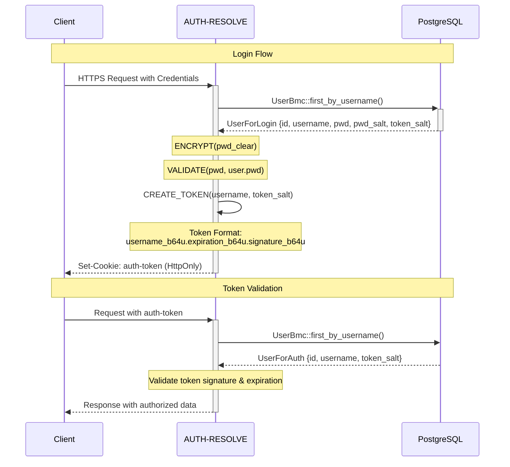

# webapp-auth

A robust, security-focused authentication library implementing multi-scheme password hashing and token-based authentication.

## Overview

webapp-auth provides a comprehensive authentication solution with a focus on security and flexibility. It features a novel multi-scheme password hashing system that allows for seamless algorithm upgrades while maintaining backward compatibility, along with a secure token-based authentication system.

## Authentication Flow

The library implements a secure authentication system with strict token validation:



### Token Structure
- Format: `username_b64u.expiration_b64u.signature_b64u`
- All components are base64url encoded for URL safety
- Enforced expiration for time-limited access
- Cryptographic signature combines all components with salt

## Security Features

### Multi-Scheme Password Hashing

The password system implements a modular, future-proof design that allows for:
- Multiple hashing schemes coexisting simultaneously
- Seamless migration between hashing algorithms
- Automatic detection of outdated hash schemes
- Zero-downtime algorithm upgrades

Currently supported schemes:
- Scheme 01: HMAC-SHA512 based hashing
- Scheme 02 (Default): Argon2id with configurable parameters

### Salting Strategy

The library implements a comprehensive salting strategy to prevent various cryptographic attacks:

- **Unique UUIDs**: Each password and token is salted with a UUID v4, ensuring uniqueness
- **Double-layered Protection**: 
  - Password hashing combines both the per-user salt and a global application key
  - Token generation uses both user-specific salt and a global signing key
- **Rainbow Table Protection**: The UUID-based salt makes precomputed rainbow table attacks infeasible
- **Cross-Application Security**: Even if the same password is used across different applications, the resulting hashes will be different

## Technical Implementation

### Salt Implementation

The salt system is implemented through the `ContentToHash` struct:

```rust
pub struct ContentToHash {
    pub content: String,  // Clear content to hash
    pub salt: Uuid,      // Unique UUID v4 salt
}
```

### Password Hashing Architecture

```rust
pub trait Scheme {
    fn hash(&self, to_hash: &ContentToHash) -> Result<String>;
    fn validate(&self, to_hash: &ContentToHash, pwd_ref: &str) -> Result<()>;
}
```

### Security Considerations
- All sensitive operations run in separate threads via `spawn_blocking`
- Secure key management through environment configuration
- No default parameters - all security settings must be explicitly configured
- Constant-time comparison for password validation
- Automatic cleanup of expired tokens

## Configuration

Environment variables:
```shell
SERVICE_PWD_KEY=<base64url-encoded-key>
SERVICE_TOKEN_KEY=<base64url-encoded-key>
SERVICE_TOKEN_DURATION_SEC=<duration-in-seconds>
```

## Dependencies

- `argon2`: Password hashing with Argon2id
- `blake3`: Modern cryptographic hashing
- `hmac` + `sha2`: HMAC-SHA512 implementation
- `tokio`: Async runtime support
- `uuid`: Unique identifier generation

## Contributing

This is a personal portfolio project by [eohyungk](https://github.com/eohyungk).

## License

MIT License

---
*Note: This library is designed for demonstration purposes. While it implements secure cryptographic practices, it should be thoroughly audited before use in production environments.*
